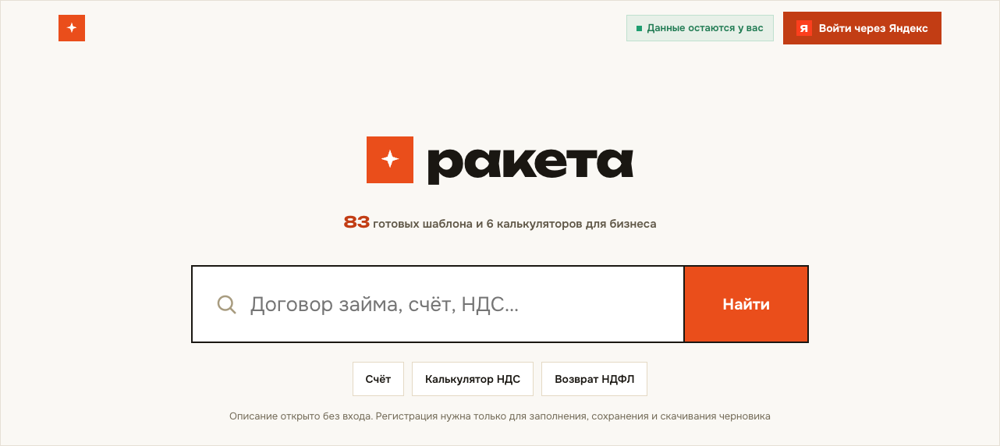
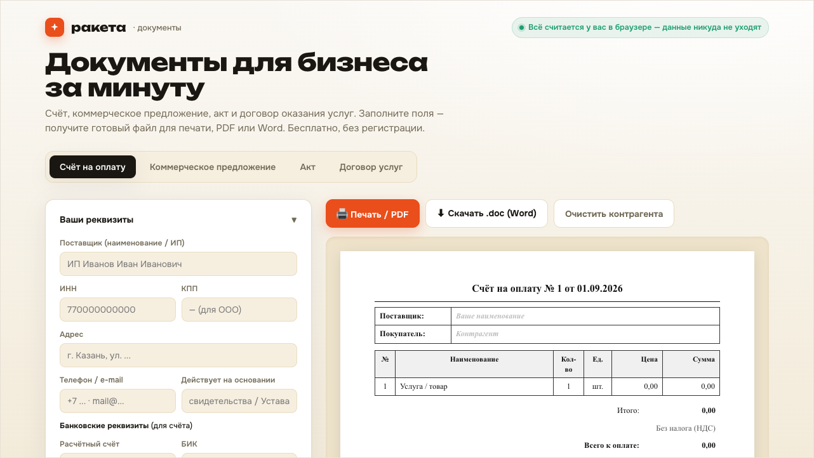
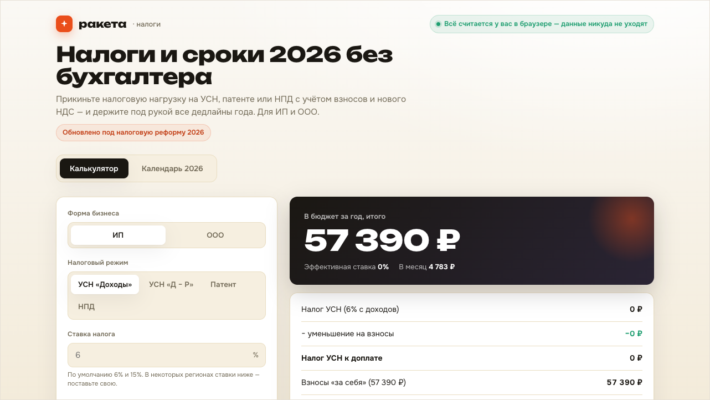

# Ракета — портал для малого бизнеса

Бесплатные инструменты для предпринимателей: шаблоны документов и налоговые калькуляторы 2026. Всё считается и заполняется прямо в браузере — данные никуда не отправляются.

<a href="https://tashev11.github.io/raketa/"></a>

**[Открыть портал →](https://tashev11.github.io/raketa/)**

---

## Документы за минуту

Счёт на оплату, коммерческое предложение, акт и договор оказания услуг. Заполняете поля — получаете готовый файл для печати, PDF или Word. Без регистрации.

<a href="https://tashev11.github.io/raketa/dokumenty.html"></a>

## Налоги и сроки 2026

Налоговая нагрузка на УСН, патенте или НПД с учётом взносов и нового НДС, плюс календарь дедлайнов года. Для ИП и ООО, обновлено под налоговую реформу 2026.

<a href="https://tashev11.github.io/raketa/nalogi-2026.html"></a>

---

## Все инструменты

- **Документы** — 83 готовых к заполнению шаблона и каталог видов документов
- **Налоги 2026** — нагрузка на УСН, патенте и НПД, календарь сроков
- **Калькулятор НДС** — выделить или начислить по ставкам 2026
- **Взносы ИП** — фиксированная часть и 1% с дохода свыше 300 000 ₽
- **Какой режим выгоднее** — сравнение УСН, патента и НПД
- **Возврат НДФЛ** — вычеты за жильё, лечение, обучение и ИИС
- **Проверка реквизитов** — ИНН, ОГРН, БИК и расчётный счёт по контрольным суммам

## Как устроено

| Файл | Назначение |
|---|---|
| `index.html` | Портал: каталог документов, поиск, личный кабинет, калькуляторы |
| `dokumenty.html` | Генератор счетов, КП, актов и договоров услуг |
| `nalogi-2026.html` | Калькулятор налоговой нагрузки и календарь сроков 2026 |
| `support.js` | Шаблонизатор и адаптивные стили |

Ни сборки, ни зависимостей, ни бэкенда — статические файлы на GitHub Pages. Все пути относительные: сайт живёт в подпапке `/raketa/`, и корневой путь вида `/support.js` его сломает.

## Запуск локально

```bash
python3 -m http.server 8743
```

Затем откройте http://localhost:8743

## Важно

Шаблоны и расчёты — типовые образцы и ориентировочные значения, а не юридическая или налоговая консультация. Для крупных или нетиповых сделок проверьте текст и цифры у юриста и бухгалтера.

## Лицензия

[CC BY-NC 4.0](LICENSE) — Creative Commons Attribution-NonCommercial 4.0 International.

Можно свободно брать, изменять и распространять материалы проекта — шаблоны, расчёты, код — **при двух условиях**: указать авторство со ссылкой на оригинал и не использовать в коммерческих целях.

© Ринат Ташев, [tashev.ru](https://tashev.ru)
